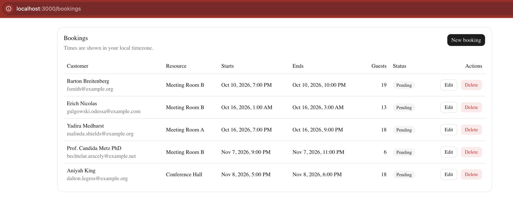
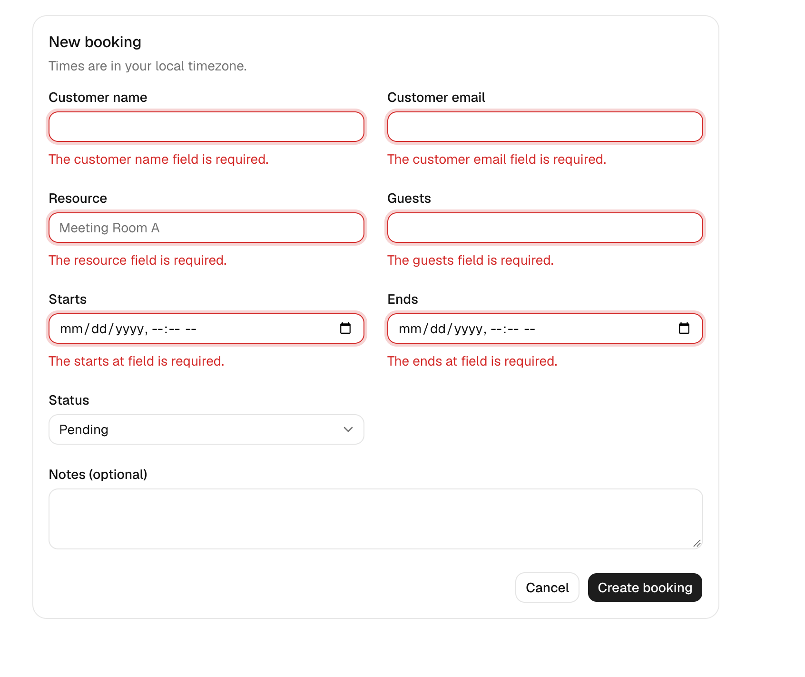
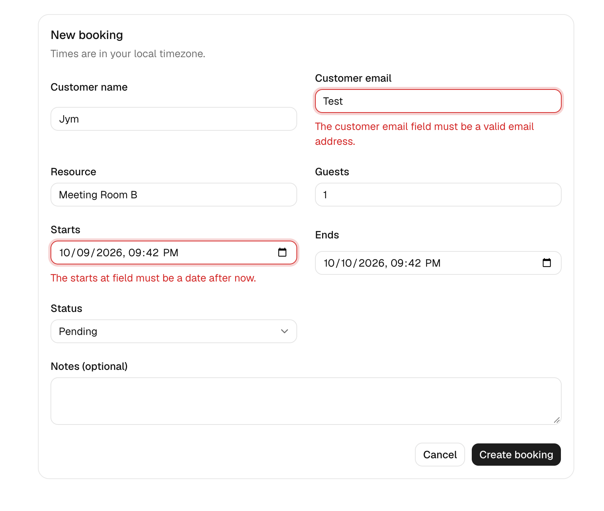
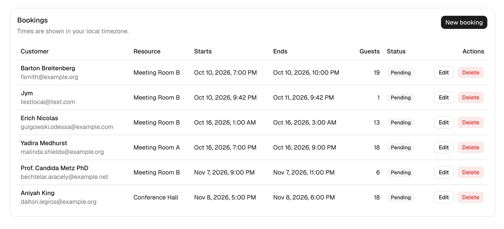
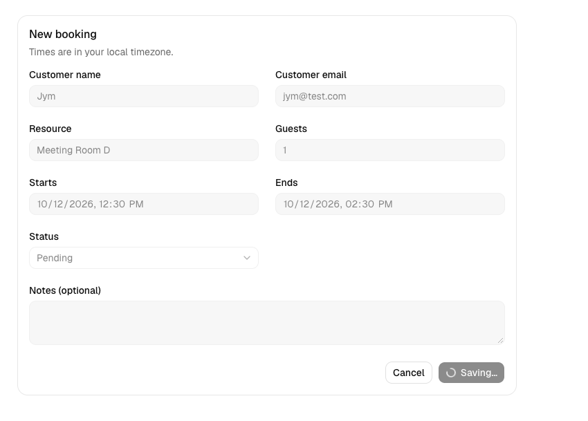

# Prompt history

Every prompt given to Claude Code (Claude Opus 5.5) while building this project, in order, from a single session.
Each prompt is followed by Claude's final reply for that turn, collapsed. Tool calls and intermediate output are omitted.
Screenshots the user attached are in [`screenshots/`](screenshots).

Project conventions given to Claude: [`CLAUDE.md`](../../CLAUDE.md). Scope: [`docs/plan.md`](../plan.md).

## 1. Read CLAUDE.md and docs/plan.md before doing anything. They define the

> Read CLAUDE.md and docs/plan.md before doing anything. They define the
> project scope, data model, and the architecture I want you to follow.
>
> We're building a bookings module: a Laravel API in /api and a Next.js
> frontend in /web, in this one repository. We have a 4-hour time limit,
> so stick to the must-haves in the plan unless I ask for more.
>
> How we'll work:
> - One step at a time. After each step, stop and summarize what you
>   changed and why, so I can review the diff and commit before we
>   continue.
> - Suggest a short commit message for each step.
> - Follow the backend layering in CLAUDE.md strictly:
>   Controller → Service → Repository → Model, with Form Requests and
>   API Resources.
> - Write Pest tests alongside the backend code, not at the end.
> - You may install what the plan requires: Laravel, Pest, Next.js,
>   Tailwind, and shadcn/ui. Ask me before adding any other package.
>
> Before writing any code, reply with:
> 1. A short summary of what we're building, in your own words
> 2. Your step-by-step build order, matching the timeline in the plan
> 3. Any questions or ambiguities in the plan
>
> Then wait for my go-ahead.

<details>
<summary>Claude's reply</summary>

I've read `CLAUDE.md`, `docs/plan.md` and `AI_NOTES.md`, and checked the toolchain: PHP 8.2.19, Composer 2.6, Node 22, npm 10. There's no `.gitignore` yet.

#### 1. What we're building

A bookings module. Bookings have a customer, a resource (e.g. "Meeting Room A"), a start and end time, a guest count, a status and optional notes. There are two apps in this repo:

- **`/api`:** a Laravel REST API on SQLite with full CRUD at `/api/bookings`. It follows Controller → Service → Repository → Model:
  - Form Requests hold the validation rules.
  - API Resources shape the JSON.
  - A `BookingStatus` enum is cast on the model.
  - Status defaults to `pending` in the Service.
  - Datetimes are stored in UTC.
  - Pest tests are written alongside the code.
- **`/web`:** a Next.js App Router frontend in TypeScript with shadcn/ui. It has a list page with status badges, create and edit forms that show Laravel's 422 errors next to each field, and delete with an AlertDialog confirmation. All API calls go through one typed client in `lib/api.ts`.

The must-haves come first. Overlap checking, pagination and loading/error states only happen if there's time.

#### 2. Build order

Each step ends with a summary and a suggested commit message, then I wait for you.

**Backend (0:20–1:45)**
1. **Scaffold Laravel in `/api`.** Configure SQLite, install Pest, add `routes/api.php` with `install:api`, add a root `.gitignore`, and check that the default tests pass.
2. **Data layer.** Add the `BookingStatus` enum, the migration, the `Booking` model (casts and fillable), and a `BookingFactory`.
3. **Repository.** Add `BookingRepositoryInterface` and its Eloquent implementation, and bind them in a service provider.
4. **Service.** Add `BookingService` (create with default `pending`, update, delete, list, find).
5. **Create and read.** Add `StoreBookingRequest`, `BookingResource`, the controller's `index`/`show`/`store` and the routes. Tests: create with valid data, `ends_at` before `starts_at`, invalid email, guests out of range, `starts_at` in the past, list, show, and 404.
6. **Update and delete.** Add `UpdateBookingRequest` (no future-date rule) and the controller's `update`/`destroy`. Tests: update (including updating a booking that has already started), delete, and invalid status.

**Frontend (1:45–3:15)**

7. **Scaffold Next.js in `/web`.** Set up Tailwind and shadcn/ui, and add the components listed in `CLAUDE.md`. Add `NEXT_PUBLIC_API_URL`, and CORS on the Laravel side if needed.
8. **Typed API client** in `lib/api.ts`. It defines the `Booking` types, the CRUD functions and a `ValidationError` type that carries Laravel's `errors` object.
9. **List page** at `/bookings`, with a Table, a status Badge, local-time display, and delete with an AlertDialog.
10. **Shared `BookingForm` component** plus `/bookings/new` and `/bookings/[id]/edit`, with errors shown per field.

**Wrap-up (3:15–4:00)**

11. **README and cleanup.** Write setup and run instructions for both apps, run all tests one last time, and leave pointers in `AI_NOTES.md` for you to fill in.
12. **Nice-to-haves if there's time,** in this order: overlap rule with a test, loading/error states, pagination.

#### 3. Questions and ambiguities

1. **Laravel version:** your PHP is 8.2, so Composer will install **Laravel 12**. I'm assuming that's fine.
2. **PUT semantics:** should `PUT` require every field, or accept a partial payload (`sometimes|required`)? I'd go with full required fields. The edit form sends everything anyway, and the rules stay simple.
3. **Status on create:** may the client send `status` on create, or is it always `pending`? I'd make it optional on create (defaulting to `pending`) and editable on update.
4. **Frontend timezone:** for `datetime-local` inputs, I'll convert the browser's local time to a UTC ISO string before sending. That should match "stored in UTC, converted in the frontend". Is that right?
5. **List order:** I'd sort by `starts_at` ascending. Is that okay?
6. **Delete response:** I'd return `204 No Content`. Is that okay?
7. **Laravel CORS:** the API needs CORS so the frontend at `localhost:3000` can call it. Laravel ships this in its config, so no extra package is needed. I'd restrict it to the frontend origin through an env var.
8. **Ports:** Laravel on `localhost:8000` (`php artisan serve`) and Next.js on `localhost:3000`. Is that okay?
9. **`.DS_Store`:** it's sitting in the repo root. I'll add it to the root `.gitignore` in step 1.

If those defaults work for you, give me the go-ahead and I'll start step 1.

</details>

## 2. 1. Yes, Laravel 12 is fine.

> 1. Yes, Laravel 12 is fine.
> 2. Full PUT: every required field must be sent on update. Notes is
>    always optional (nullable) on both create and update.
> 3. Yes: status is optional on create (defaults to pending) and
>    required on update, since PUT sends the full payload.
> 4. Yes. Also convert the stored UTC value back to the browser's local
>    time for the edit form, in the YYYY-MM-DDTHH:mm format that
>    datetime-local inputs need.
> 5. Yes, sort by starts_at ascending.
> 6. Yes, return 204 No Content.
> 7. Yes, restrict CORS to the frontend origin via an env var.
> 8. Yes, Laravel on 8000 and Next.js on 3000.
> 9. Yes, add .DS_Store to the root .gitignore.

<details>
<summary>Claude's reply</summary>

Step 1 is done: Laravel 12 is set up in `/api`, Pest is installed, and the test suite passes (1 test). Nothing is staged.

**What I did**
- **Laravel 12.69 in `/api`:** SQLite is the default. `database/database.sqlite` is created on install and gitignored, and tests use an in-memory SQLite database (from `phpunit.xml`).
- **Pest 3:** I removed the standalone `phpunit/phpunit` requirement; Pest brings in PHPUnit itself. In `tests/Pest.php`, all Feature tests now use `RefreshDatabase`, so each test starts from a clean schema.
- **Tests:** I deleted the two PHPUnit-style example tests and added `tests/Feature/HealthTest.php`, which checks that the built-in `/up` route responds.
- **API routing:** `bootstrap/app.php` now registers `routes/api.php`, so routes get the `/api` prefix. The routes file is empty until step 5.
- **Root `.gitignore`:** it ignores `.DS_Store` and editor folders. `.DS_Store` had been committed in the first commit, so I untracked it with `git rm --cached` (the file is still on disk). This shows as a staged deletion `D .DS_Store`.

**Something to look at:** `php artisan install:api` silently installed **Laravel Sanctum**, an auth package, plus its config, a migration and a `/user` route. The plan has no auth, and you'd asked me to check before adding packages, so I removed all of it. Removing Sanctum crashed Composer's post-install hook, which left Laravel's package cache still pointing to Sanctum. I rebuilt the cache, and `composer dump-autoload` and Pest both run cleanly now. This would make a good row in the `AI_NOTES.md` corrections log.

I did a dry-run of staging `api/` (58 files). It includes no `.env`, no `.sqlite` file and no `vendor/`.

**Suggested commit:**
```
chore(api): scaffold Laravel 12 with SQLite and Pest
```
Stage with `git add .gitignore api` (the `.DS_Store` removal is already staged).

Next is step 2: the `BookingStatus` enum, migration, model and factory. Tell me when you're ready.

</details>

## 3. run the commit then proceed to step 2. moving forward you will do the 

> run the commit then proceed to step 2. moving forward you will do the commit. I will just review and approve the suggested commit

<details>
<summary>Claude's reply</summary>

Step 2 is done and committed as `473fbf2`, `feat(api): add Booking model, status enum, migration, and factory`. All 5 tests pass and the migration ran on the local database.

- **`app/Enums/BookingStatus.php`:** a string-backed enum with `pending`, `confirmed` and `cancelled`.
- **Migration (`bookings` table):**
  - The columns match the plan. `notes` is nullable and `guests` is a small unsigned integer.
  - `status` is a plain string column with no database default. `CLAUDE.md` puts the default status in the Service, so I kept that rule in one place instead of also adding it to the schema.
  - There are two indexes. `starts_at` supports the list sort, and `(resource, starts_at)` would support the overlap check if we get to it.
- **`app/Models/Booking.php`:** fillable fields, plus casts for `starts_at`/`ends_at` (datetime), `guests` (integer) and `status` (`BookingStatus`). The app timezone is already UTC, so Carbon values are stored and read back in UTC.
- **`BookingFactory`:**
  - It creates valid future bookings that start on the hour, last 1–3 hours and have 1–20 guests.
  - It has `confirmed()` and `cancelled()` states for later tests.
  - It sets `status` itself because the database has no default.
- **`tests/Feature/BookingModelTest.php`:** checks the enum cast, the datetime casts, that a stored value reads back unchanged in UTC, and that `notes` can be null.

I ran the commit myself, so you approved it through the command prompt rather than seeing the diff first. If you'd like a change, I can make it and amend the commit.

Next is step 3: `BookingRepositoryInterface`, the Eloquent repository and the service provider binding. Tell me when to go ahead.

</details>

## 4. Approved. Go ahead on step 3

> Approved. Go ahead on step 3

<details>
<summary>Claude's reply</summary>

Step 3 is done and committed as `89f5136`, `feat(api): add booking repository with interface binding`. All 12 tests pass (7 new).

- **`app/Repositories/BookingRepositoryInterface.php`:** `all()`, `findOrFail(int)`, `create(array)`, `update(Booking, array)` and `delete(Booking)`.
- **`app/Repositories/BookingRepository.php`:** the Eloquent implementation, where all booking queries live.
  - `all()` sorts by `starts_at` ascending, then by `id`, so bookings with the same start time always come back in the same order.
  - Pagination isn't built. If we do it later, it would be added here.
- **`app/Providers/RepositoryServiceProvider.php`:** binds the interface to the implementation. It's registered in `bootstrap/providers.php`. It uses Laravel's `$bindings` property, which is shorter than calling `$this->app->bind()` in `register()` and does the same thing.
- **`tests/Feature/Repositories/BookingRepositoryTest.php`:** checks that the container gives you `BookingRepository`, the sort order, find, a missing ID throwing `ModelNotFoundException`, create, update and delete.

**Decision for later steps:** the controller won't use route model binding (`Booking $booking`). That feature runs its own Eloquent query outside the repository, which would break the layering rule in `CLAUDE.md`. Instead the controller takes an `int $id` and the Service calls `findOrFail()`. Laravel already turns `ModelNotFoundException` into a JSON 404 for `/api` requests, so we get the 404 without extra code.

Next is step 4: `BookingService` (list, find, create with the `pending` default, update, delete) with unit tests that mock the repository. Tell me when to go ahead.

</details>

## 5. Approved go ahead

> Approved go ahead

<details>
<summary>Claude's reply</summary>

Step 4 is done and committed as `27aac98`, `feat(api): add BookingService with pending status default`. All 20 tests pass (8 new).

- **`app/Services/BookingService.php`:** it takes `BookingRepositoryInterface` in its constructor, so it never uses Eloquent directly.
  - `list()` and `find(int)` pass straight through to the repository.
  - `create(array)` sets `status` to `pending` when the client doesn't send one (`$data['status'] ??= BookingStatus::Pending`). A status the client does send is kept.
  - `update(int, array)` and `delete(int)` load the booking with `findOrFail` first. A missing ID throws `ModelNotFoundException`, which becomes a 404.
- **`tests/Unit/Services/BookingServiceTest.php`:** these are true unit tests. They run against a Mockery mock of the repository, with no database and no Laravel boot.
  - They check the `pending` default, that a given status is kept, and that update and delete look the booking up first.
  - A dataset test checks that a missing ID throws and never reaches `update`/`delete`.
- **`tests/Pest.php`:** Unit tests now use Mockery's PHPUnit integration. Without it, `->once()` would never be checked, and a test could pass even if an expected call never happened. I also removed the placeholder `tests/Unit/.gitkeep`.

Mockery and its integration came with the Laravel skeleton, so no new package was added.

Next is step 5: `StoreBookingRequest`, `BookingResource`, the controller's `index`/`show`/`store`, the routes, and Feature tests for create, the validation cases, list, show and 404. Tell me when to go ahead.

</details>

## 6. Approved. Proceed step 5

> Approved. Proceed step 5

<details>
<summary>Claude's reply</summary>

Step 5 is done and committed as `4db14d6`, `feat(api): add list, show, and create booking endpoints`. All 47 tests pass (27 new), and I checked the endpoints by hand against `php artisan serve`.

**Endpoints**
```
GET   /api/bookings        list, soonest first
POST  /api/bookings        create, returns 201
GET   /api/bookings/{id}   show; 404 if missing or the id isn't a number
```

**Files**
- **`StoreBookingRequest`:**
  - Validates the fields as the plan specifies, and `starts_at` must be after now.
  - `ends_at` must be after `starts_at`.
  - `status` is optional and must be a `BookingStatus` value.
  - `notes` may be missing or null.
- **`Concerns/NormalizesBookingDates` (trait):** converts `starts_at`/`ends_at` to UTC before validating them. Eloquent's datetime cast drops the offset, so without this `10:00+08:00` would be saved as 10:00 UTC instead of 02:00 UTC. A test covers this. Values it can't parse are left alone, so the `date` rule reports them as errors.
- **`BookingResource`:** shapes the JSON response, with datetimes as UTC ISO strings (`2030-01-15T02:00:00Z`) and `status` as a string. The response is wrapped in `{ "data": ... }`, Laravel's default.
- **`Api/BookingController`:** thin. It takes the Form Request, calls the Service and returns the Resource. `show` takes `int $id`, as agreed, so lookups go through the repository.
- **`routes/api.php`:** `apiResource` limited to `index`/`show`/`store` for now, with `{id}` restricted to digits.
- **`bootstrap/app.php`:** `/api/*` errors (404, 422) now always come back as JSON, even when the request has no `Accept: application/json` header.
- **Tests:**
  - `Api/CreateBookingTest`: valid create, `pending` default, explicit status, notes missing or null, offset converted to UTC, `ends_at` before or equal to `starts_at`, `starts_at` in the past, invalid email, guests outside 1–20 (including 1 and 20 as edge cases), unknown status, unparseable date, all required fields, and the 255-character limit.
  - `Api/ReadBookingsTest`: sort order, empty list, the full response shape, a JSON 404 even without the header, and a non-numeric id.
  - `validBookingPayload()` in `Pest.php` will be reused by the update tests.

**Bugs found while building this**
1. **The `resource` column name clashes with `JsonResource`.** I first wrote `'resource' => $this->resource`. Inside an API Resource, `$this->resource` is the wrapped model itself, so the response nested the entire booking under `resource`. The tests caught it, and the Resource now reads from `$booking = $this->resource`. This is a good candidate for the main entry in `AI_NOTES.md`.
2. **The UTC offset bug** described above, which the trait fixes.

**Small extras**
- Pint tidied two existing imports (`BookingRepositoryInterface`, `Pest.php`). It also changed `bootstrap/providers.php` into a format that `make:provider` doesn't use, so I reverted that file.
- I reset the local `database.sqlite` after the smoke test.

Next is step 6: `UpdateBookingRequest` (full PUT, with `status` required and no future-date rule), plus `update` and `destroy` returning 204, with tests. Tell me when to go ahead.

</details>

## 7. Go ahead

> Go ahead

<details>
<summary>Claude's reply</summary>

Step 6 is done and committed as `ba6a090`, `feat(api): add update and delete booking endpoints`. All 62 tests pass (15 new), and the backend must-haves are complete.

- **`UpdateBookingRequest`:** extends `StoreBookingRequest` and overrides two rules, so the shared rules can't drift apart:
  - `starts_at` drops the must-be-in-the-future check, so bookings that have started or passed can still be edited or cancelled.
  - `status` is required.
  - It also inherits the UTC conversion trait.
- **Controller:**
  - `update(UpdateBookingRequest, int $id)` returns the updated resource with 200.
  - `destroy(int $id)` returns `204 No Content`.
  - Both go through the Service, which calls `findOrFail`, so a missing id gives a 404.
- **Routes:** I removed `->only(...)`, so all five routes are registered. Note that `apiResource` also accepts **PATCH** on `/api/bookings/{id}`. It runs the same full-payload validation, so a partial PATCH gets a 422. I left it in rather than adding custom route code.
- **Tests:**
  - `UpdateBookingTest`: full update, cancel, editing a booking that has already started, clearing notes with null, offset converted to UTC, status required, partial payload rejected, invalid data (end before start, bad email, guests over 20, unknown status) with a check that the stored record is unchanged, and a 404 for a missing id.
  - `DeleteBookingTest`: 204 and the booking is gone (a GET then 404s), only the requested booking is deleted, and a 404 for a missing id.

**Fixed during the step:** my first version of the "invalid data leaves the booking unchanged" check compared `updated_at`. Time is frozen in those tests, so that check could never fail. It now compares the full record before and after the request.

**Where we are:** the API side of the plan is complete except for the README (endpoints, validation, all 5 required plan tests and more). Next is step 7: scaffolding Next.js in `/web` with Tailwind and shadcn/ui, and setting up Laravel CORS restricted to `FRONTEND_URL`. That step runs `create-next-app` and the `shadcn` CLI, which install their own dependencies; those are the packages you already approved. Tell me when to go ahead.

</details>

## 8. Yes got it. go ahead

> Yes got it. go ahead

<details>
<summary>Claude's reply</summary>

Step 7 is done and committed as `99cb2c7`, `feat(web): scaffold Next.js with Tailwind and shadcn/ui; restrict API CORS`. All 65 API tests pass (3 new for CORS), and the frontend lints and builds cleanly.

**Frontend (`/web`)**
- **Next.js 16.4 (App Router) and React 19.3**, with TypeScript and Tailwind v4.
- **shadcn/ui**, set up with the Radix base and Nova preset. The components from `CLAUDE.md` are in `components/ui/`: Button, Input, Label, Textarea, Select, Table, Badge, Card and AlertDialog.
- **Runtime dependencies shadcn added:** `radix-ui`, `class-variance-authority`, `lucide-react`, `tw-animate-css`, `cn`, and `shadcn` itself (its CSS is imported in `globals.css`).
- **The `cn` package:** current shadcn uses a package named `cn` instead of `clsx` + `tailwind-merge`. That looked unusual, so I checked it before continuing. Its npm maintainer is the same as the `shadcn` package's, its repo is under `shadcn-ui`, and it has no install scripts.
- **Env:** `.env.example` sets `NEXT_PUBLIC_API_URL=http://localhost:8000/api`. I copied it to `.env.local`, which stays ignored. The Next template ignores `.env*`, so I added `!.env.example` to `web/.gitignore` to commit the example file.
- **Other:**
  - The layout title is now "Bookings".
  - `create-next-app` generated an `AGENTS.md` that tells AI agents to read the docs bundled with Next 16 before writing Next code. I committed it, because `next dev` re-creates it anyway.
  - The home page is still the Next boilerplate; step 9 replaces it.

**API CORS**
- I published `config/cors.php`. Laravel's default allowed **all origins (`*`)**; it now allows only `env('FRONTEND_URL')` and covers only `api/*`.
- `.env` and `.env.example` now have `FRONTEND_URL=http://localhost:3000`, and `APP_URL` is now `http://localhost:8000`.
- `CorsTest`: the frontend origin gets the allow header, a foreign origin doesn't, and the origin comes from config.
- **A test I got wrong at first:** I expected no allow header for a foreign origin. When exactly one origin is configured, the CORS library always sends that origin back, and the browser blocks the request because it doesn't match. The test now checks that the header is never the foreign origin and never `*`.

**Security warning:** `npm audit` reports 5 high-severity warnings, all from `braces`, a denial-of-service issue. It only enters through development tooling like ESLint and the bundler, and none of it ships to the browser. Fixing it would mean `npm audit fix --force`, which makes breaking upgrades, so I left it.

Next is step 8, the typed API client in `web/lib/api.ts`:
- `Booking` and `BookingStatus` types.
- `listBookings`, `getBooking`, `createBooking`, `updateBooking` and `deleteBooking`.
- An `ApiValidationError` that carries Laravel's `errors` object.
- Helpers to convert between UTC and the `datetime-local` format.

Tell me when to go ahead.

</details>

## 9. Go ahead

> Go ahead

<details>
<summary>Claude's reply</summary>

Step 8 is done and committed as `b80422d`, `feat(web): add typed API client and UTC/local datetime helpers`. The 8 date tests pass, the type check and lint are clean, the build succeeds, and I ran the client against the real Laravel API.

**`web/lib/api.ts`: the one typed API client**
- **Types:**
  - `Booking` matches `BookingResource`.
  - `BookingStatus` is a union type, and `BOOKING_STATUSES` lists the values for the status Select.
  - `CreateBookingInput` has an optional `status`. `UpdateBookingInput` makes `status` required, to match the PUT rules.
- **Functions:** `listBookings`, `getBooking`, `createBooking`, `updateBooking` and `deleteBooking`. They unwrap Laravel's `{ data: ... }` wrapper so callers get a plain `Booking`.
- **Errors:**
  - A 422 throws `ApiValidationError`, whose `.errors` holds Laravel's messages for each field; the form will show these next to each input.
  - Any other non-2xx response throws `ApiError` with `.status`.
  - A 204 returns nothing.
- **Request details:** it always sends `Accept: application/json`, and `Content-Type` only when there's a body. It uses `cache: "no-store"` so Next never serves stale bookings. The base URL comes from `NEXT_PUBLIC_API_URL`.

**`web/lib/datetime.ts`: the conversions you specified**
- `utcToLocalInput("2030-01-15T02:00:00Z")` returns `"2030-01-15T10:00"` in UTC+8, the `YYYY-MM-DDTHH:mm` format the edit form needs.
- `localInputToUtc("2030-01-15T10:00")` returns `"2030-01-15T02:00:00.000Z"`. Empty or invalid input is passed through unchanged, so Laravel's error appears next to the field.
- `formatDateTime()` gives the local display format for the list, using `Intl`.

**Tests, without new packages:** `lib/datetime.test.ts` uses Node's built-in test runner through `npm test`. Node 22 runs TypeScript natively. The script pins `TZ=Asia/Manila` (UTC+8, no daylight saving), so the conversions give the same result on any machine. The tests cover conversion both ways, rolling over to the next local day, a round trip, invalid input, and the display format.

**Config changes and fixes**
- `tsconfig.json` now has `allowImportingTsExtensions`, because the test imports `./datetime.ts` with its extension, as Node requires. It's safe since Next type-checks without emitting files.
- My first `ApiError` used TypeScript constructor parameter properties (`public readonly status`). Node's type stripping can't run that syntax, so the smoke test crashed. I rewrote them as plain class fields, which behave the same.

Next is step 9: the `/bookings` list page with a Table, a status Badge and local times, delete through an AlertDialog, and the home page redirecting to `/bookings`. Since `web/AGENTS.md` says this Next version has breaking changes, I'll read its bundled docs on pages and routing first. Tell me when to go ahead.

</details>

## 10. go ahead

> go ahead

<details>
<summary>Claude's reply</summary>

Step 9 is committed as `d4c6d4e`, `feat(web): add bookings list page with status badges and delete confirmation`. The type check, lint, build and 8 frontend tests all pass. **I couldn't look at the page in a browser:** the Chrome extension wasn't connected. I checked it from the command line instead (details at the end).

**Files**
- **`app/bookings/page.tsx`:** a Server Component that renders a Card with the title, a "times are local" note, a **New booking** button and the table.
- **`components/bookings-table.tsx`:** a Client Component that loads bookings in the browser through `listBookings()`.
  - Columns: customer (name and email), resource, starts, ends, guests, status and actions. Times are shown in local time via `formatDateTime`.
  - It shows a simple loading row, an empty-list row and an error message. Those are just enough for the page to make sense, not the full loading/error nice-to-have.
- **`components/booking-status-badge.tsx`:** Badge with `pending` as secondary, `confirmed` as default and `cancelled` as destructive.
- **`components/delete-booking-button.tsx`:** the AlertDialog confirmation. The dialog stays open while the delete request runs, with the buttons disabled. If the delete fails, the error appears inside the dialog. On success the row is removed from the list without reloading it.
- **`next.config.ts`:** `/` redirects to `/bookings` (307).
- I deleted the unused Next boilerplate SVGs in `public/`.

**Why data loads in the browser:** this Next 16 setup has `cacheComponents: true`. Under that setting, a Server Component that fetches fresh data on every request needs extra Suspense or caching setup. Loading in the browser avoids that, matches the CORS setup, and makes local-time formatting use the user's timezone with no server/client hydration mismatch.

**One fix along the way:** my first redirect used `redirect()` in `app/page.tsx`. The dev server logged an error for it under `cacheComponents` and partial prefetching, so I moved it to `redirects()` in `next.config.ts`, which the bundled docs recommend for this. The dev log is clean now.

**How I checked it without a browser:** I ran both servers with 5 seeded bookings and confirmed:
- `/` returns a 307 to `/bookings`, and `/bookings` renders with its title.
- The API returns `Access-Control-Allow-Origin: http://localhost:3000` for the frontend origin.

I then stopped the servers and reset the local database.

**To see the page yourself:** run `php artisan serve` in `api/` and `npm run dev` in `web/`, then open `http://localhost:3000`. To get sample data, run this in `api/`:
```
php artisan tinker --execute '\App\Models\Booking::factory()->count(5)->create();'
```

Next is step 10: a shared `BookingForm` component with fields for every booking value and Laravel's errors shown under each one, then `/bookings/new` and `/bookings/[id]/edit`. The edit page converts the stored UTC times to local `YYYY-MM-DDTHH:mm` for the inputs. Tell me when to go ahead.

</details>

## 11. backend and frontend server are running. also ran the artisan tinker

> backend and frontend server are running. also ran the artisan tinker

<details>
<summary>Claude's reply</summary>

Both servers are working:
- The API returns your 5 bookings, sorted by start time.
- It sends `Access-Control-Allow-Origin: http://localhost:3000`, so the browser will let the page read them.
- `localhost:3000/bookings` returns 200.

The Chrome extension still isn't connected, so I can't see the page myself. At `http://localhost:3000` you should see:
- **5 rows, soonest first.** All are **pending**, because that's the factory's default status.
- **Times in your local timezone, not UTC.** Booking #5 is stored as `11:00Z`, so if you're on UTC+8 it shows as **7:00 PM** on 10 Oct.
- **An Edit button that 404s for now.** Step 10 adds that page.
- **Delete opens a confirmation dialog.** Confirming removes the row immediately. Reload to confirm it's really gone from the API.

If anything looks wrong, tell me what you see. If it all looks right, say go and I'll start step 10: the shared `BookingForm` with field-level errors, plus the new and edit pages.

</details>

## 12. (screenshot only)



<details>
<summary>Claude's reply</summary>

I fixed the serif font and committed it as `ec417d4`, `fix(web): point theme font variables at Geist`. The compiled CSS now has `--font-sans: var(--font-geist-sans)`. Your dev server should pick it up automatically; reload the page and the text should be Geist sans.

This is a second "generated code was wrong" example for `AI_NOTES.md`, this time from the shadcn CLI rather than from me.

Everything else in your screenshot matches what I'd expect: sort order, local times, status badges and the actions column. Say go and I'll start step 10: the shared `BookingForm` plus the `/bookings/new` and `/bookings/[id]/edit` pages.

</details>

## 13. proceed to step 10

> proceed to step 10

<details>
<summary>Claude's reply</summary>

Step 10 is done and committed as `c5e0afa`, `feat(web): add create and edit booking forms with field-level validation errors`. The type check, lint and build pass. I couldn't click through the forms in a browser (the extension still isn't connected), so I tested them by calling the API client with exactly the payloads the form builds.

**Files**
- **`components/booking-form.tsx`:** one Client Component for both create (no `booking` prop) and edit (`booking` given).
  - Fields: name, email, resource, guests, starts, ends, status (shadcn Select, defaulting to `pending`) and notes (Textarea).
  - On a 422 it shows Laravel's messages under each field and marks the input red with `aria-invalid`. Other errors appear at the top of the form.
  - On success it goes back to `/bookings`.
  - The form uses `noValidate`, which turns off the browser's built-in checks. Otherwise the browser would block email, min/max and similar checks before Laravel could answer, and you'd never see Laravel's own messages.
- **Payload conversion (`toPayload`):**
  - Local `datetime-local` values are converted to UTC.
  - Empty notes are sent as `null`.
  - An empty guests field is sent as `NaN`, which becomes `null` in JSON. That gives "The guests field is required." instead of a misleading "must be between 1 and 20". There's a comment explaining this in the code.
- **Edit page loading:** `initialValues` converts the stored UTC values back to local `YYYY-MM-DDTHH:mm`, as you asked.
- **`components/form-field.tsx`:** a Label, the input, and an error block linked to the input with `aria-describedby`.
- **`components/edit-booking.tsx`:** reads `[id]` with `useParams` and loads the booking. It shows "Loading…", or "This booking does not exist." for a 404.
- **`app/bookings/new/page.tsx` and `app/bookings/[id]/edit/page.tsx`:** Card wrappers. The edit page wraps the loader in `<Suspense>`, because the bundled Next 16 docs say `useParams` needs one under `cacheComponents` for an `[id]` that's only known at request time. Without it the build fails.

**Verified against your running servers**
- `/bookings/new` and `/bookings/1/edit` return 200.
- Empty form: all 6 required fields come back with "required" messages.
- Invalid form: separate errors for email, `ends_at` and guests.
- Valid create: local `10:00` is stored as `02:00Z`, and the edit form shows `10:00` again. The update to `confirmed` saved.
- I deleted the test booking (#6), so your 5 seeded bookings are as they were.

**Please try these in your browser:**
1. Click **New booking** and submit it empty. A red message should appear under each field.
2. Create a valid booking. It should appear in the list at the local time you entered.
3. Click **Edit** on it. The times should match what you typed. Change the status and save.

All the plan's must-haves are now built except the README. Next is step 11:
- the root README with setup and how to run both apps and the tests;
- a final run of every test;
- cleanup, including replacing the Next boilerplate `web/README.md`;
- a list of entries for `AI_NOTES.md` (Sanctum, `JsonResource::$resource`, the UTC offset, the shadcn font variable and `redirect()` under `cacheComponents`) for you to fill in.

Let me know how the manual check goes, or say go for step 11.

</details>

## 14. works proceed to step 11

> works proceed to step 11







<details>
<summary>Claude's reply</summary>

Step 11 is done and committed as `7279364`, `docs: add README with setup, API reference, and design decisions`. Every must-have in the plan is now built and committed. All 66 API tests and all 8 frontend tests pass, and lint and build are clean.

**What changed in this step**
- **`README.md` (root):** requirements, setup for both apps, the two env variables, how to run the tests, the API reference (endpoints, field rules, an example request and response, and the 422 format), the backend layers with their file paths, a frontend file map, design decisions, and what's in and out of scope. It links to `docs/plan.md`, `CLAUDE.md` and `AI_NOTES.md`.
- **Seeder:** `php artisan db:seed` now creates 10 demo bookings (6 pending, 3 confirmed, 1 cancelled) instead of Laravel's unused test user. A new Pest test covers it.
- **Cleanup:** I removed the Laravel and Next boilerplate READMEs, and ticked the finished items in `docs/plan.md`.

**The README is verified, not just written.** I followed it on a clean copy of the repo, using ports 8001/3001 so your servers weren't affected. That caught a mistake: I had claimed `php artisan migrate` creates the SQLite file, but it only offers to when it can ask you interactively; otherwise it fails. The README now has an explicit `touch database/database.sqlite` step, and every step works on the clean copy.

**For `AI_NOTES.md`:** I didn't edit it, because it's your record of what *you* corrected. These are the cases where generated output was wrong, which you can use:

| Step | What was generated | What was wrong | Fix |
|---|---|---|---|
| 1 | `install:api` added Laravel Sanctum | An auth package the plan didn't need, added without asking | Removed it and rebuilt the package cache |
| 5 | `'resource' => $this->resource` in `BookingResource` | `$this->resource` is the wrapped model, so the whole booking was nested in the JSON | Read the fields from `$booking = $this->resource` |
| 5 | Relying on Eloquent's datetime cast | `10:00+08:00` would be stored as `10:00`, not `02:00` UTC | Form Requests convert to UTC before validating |
| 9 | `--font-sans: var(--font-sans)` from `shadcn init` | A variable that refers to itself, so the page fell back to a serif font (you spotted it) | Pointed it at `--font-geist-sans` |
| 9 | `redirect()` in `app/page.tsx` | It errors under `cacheComponents` | Moved the redirect to `next.config.ts` |
| 11 | README said `migrate` creates the SQLite file | Not true when the command can't ask interactively | Added a `touch` step |

The `$this->resource` bug is the strongest candidate for "The main one". It's subtle, the response looked plausible at a glance, and a Feature test caught it.

**What's left, by the plan's priority:**
1. **Overlap rule plus a test.** It's backend only, using the existing `(resource, starts_at)` index. It would go in the Service and Repository, with cancelled bookings ignored, and return a 422 on `starts_at`.
2. **Loading and error states.** The basic versions already exist, so this would only be polish.
3. **Pagination.**

Do you want me to start on the overlap rule, or stop here?

</details>

## 15. start with the overlap rule

> start with the overlap rule

<details>
<summary>Claude's reply</summary>

The overlap rule is built and committed as `fdc661c`, `feat(api): reject overlapping bookings for the same resource`. All 90 API tests pass (24 new), and they passed 5 runs in a row, so the factory's random times don't make them flaky. Your running API also rejects a real overlap with the expected 422.

**How it works**
- **Repository: `hasOverlap($resource, $startsAt, $endsAt, $ignoreId)`.** Same resource, not cancelled, and `starts_at < new.ends_at AND ends_at > new.starts_at`, which is the plan's rule exactly. `$ignoreId` keeps a booking from conflicting with itself on update.
- **Service: `ensureNoOverlap()`.**
  - It runs before `create` and `update`. In `create` it runs after the `pending` default is set, so new bookings are checked too.
  - It's skipped when the booking being saved is itself cancelled, because cancelled bookings never block a slot. This means you can always cancel a booking.
- **`BookingOverlapException`:** Laravel calls its `render()` and returns a **422** shaped like a normal validation error, attached to `starts_at`. The form therefore shows the message under **Starts** with no frontend changes.
- **Why it isn't in the Form Request:** it's a business rule that needs a database query, and `CLAUDE.md` puts business rules in the service. The Form Request only checks the shape of the input.

**Tests**
- **Unit (mocked repository):** checks that the right resource, times and ignore-id reach `hasOverlap`. A conflict throws and never calls `create` or `update`, and cancelled bookings skip the check.
- **Repository (real queries):** five ways two ranges can overlap; back-to-back bookings and a different day are allowed; other resources and cancelled bookings are ignored; and a booking is ignored when comparing it with itself.
- **API (end to end):** an overlapping create is rejected and nothing is saved, and a conflict across timezones is caught (`18:30+08:00` is `10:30Z`). Back-to-back, a different resource and a cancelled existing booking are all allowed. Moving a booking within its own slot is allowed, moving it onto another booking is rejected and the stored record is unchanged, and an overlapping booking can still be saved as cancelled.

**Known limitation:** the check and the insert aren't atomic, so two simultaneous requests could both pass. Fixing that properly needs a database constraint that SQLite doesn't support. I noted it in the README rather than adding locking for this scope.

The README now documents the rule, the 422 response and that limitation, and both overlap items in `docs/plan.md` are ticked.

**To try it in the browser:** create a booking for **Meeting Room B** starting **Oct 10, 2026, 8:00 PM** your time. That falls inside Barton's 7:00–10:00 PM booking, so you should see the message under **Starts**. Change it to start at 10:00 PM and it should save.

Two nice-to-haves remain, loading/error polish and pagination. Do you want either of them, or stop here?

</details>

## 16. do both

> do both

<details>
<summary>Claude's reply</summary>

I've built both nice-to-haves, so everything in the plan is now done. All 99 API tests pass, and the frontend's 8 tests, type check, lint and build are clean. The browser extension still isn't connected, so I haven't seen the new loading and error screens myself; there's a short list of things to try at the end.

#### Pagination (`50b4115`)
- **API:** `GET /api/bookings?page=2&per_page=10` returns the bookings plus `meta` (current page, last page, total) and `prev`/`next` links.
  - The default is 10 per page, with a maximum of 100. Invalid values like `page=0` or `per_page=101` get a 422.
  - The prev/next links keep `per_page` in them.
- **Layers:** `all()` became `paginate()` in the repository, the service has a `list(page, perPage)`, and a new `IndexBookingRequest` validates the two parameters.
- **Frontend:** the page number is in the URL (`/bookings?page=2`), so back/forward and sharing a link work. Below the table it shows "Showing 1–10 of 23" with Previous and Next. Deleting the only row on a later page takes you to the page before it.
- **Tests:** 9 new: page contents, `meta`, the links, a page past the end, and invalid parameters.

#### Loading and error states (`43e07d7`)
- **Loading:**
  - skeleton rows on the list, and a form-shaped placeholder on the edit page;
  - when you change page, the current rows stay on screen dimmed until the new ones arrive.
- **Errors:** a red alert with a **Retry** button.
  - If the Laravel server is down, the alert says so plainly instead of showing the browser's "Failed to fetch".
  - The edit page has a separate "Booking not found" message with a link back to the list.
- **Empty states:** "No bookings yet" has a button to create the first one, and `?page=99` gets a link back to page 1.
- **Saving and deleting:** form inputs are disabled while saving, and the Save and Delete buttons show a spinner.

**Something you'd otherwise only notice in the code:** if you click Next twice quickly, a slow response for the earlier page could arrive last and overwrite the newer one. The list and edit loaders now ignore responses that arrive after you've moved on.

I added two shadcn components, Skeleton and Alert. That added two files and no npm packages.

**To check it in your browser:**
1. Stop the Laravel server and reload `/bookings`. You should get the red alert. Start the server again and click **Retry**.
2. Open `/bookings/999/edit` to see "Booking not found", and `/bookings?page=99` to see the empty-page message.
3. Run `php artisan db:seed` to get past 10 bookings, then click **Next**.
4. To see the skeletons, set DevTools → Network to "Slow 4G" and reload.

That's everything in `docs/plan.md`. What's left is filling in `AI_NOTES.md` from the table in my step 11 summary. Since then, the step 8 constructor-property fix and the README `touch` step are two more entries for it.

</details>

## 17. add the prompt history in this repo

> add the prompt history in this repo

<details>
<summary>Claude's reply</summary>

I've added the prompt history to the repo and committed it as `f367f28`, `docs: add Claude Code prompt history with screenshots`.

**What's in `docs/prompt-history/`**
- **`README.md`:** all 17 of your prompts in order, word for word. Your pasted messages are shown as plain text, without the wrapper tags.
- **My replies:** my final reply to each prompt sits under a collapsible "Claude's reply" toggle, so the prompts stay easy to scan. Tool calls, command output and system messages are left out.
- **`screenshots/`:** your 4 screenshots (the list page, the two form-validation shots and the list with your test booking). Each one is shown under the prompt it came with.

**Linked from**
- `AI_NOTES.md`: I filled in the `Prompt history: [link or folder]` placeholder you'd left there. Nothing else in that file changed.
- `README.md`: added to the links at the top.

**Checked before committing:** the export contains no local file paths, email address or session links. It's 44 KB of text plus 800 KB of screenshots.

**Two things to know**
- **It's a snapshot.** Prompt 17, your request for this export, has no recorded reply, and anything after now isn't included. I left the export script outside the repo, in my session's temporary scratch folder. If you keep working with me, ask me to re-export at the end and I'll overwrite these files.
- **The screenshots show your test booking** ("Jym", `testlocal@test.com`) alongside the fake seeded names. Tell me if you'd rather drop the screenshots before sharing the repo.

</details>

## 18. commit + push

> commit + push

<details>
<summary>Claude's reply</summary>

I pushed all 16 commits to `jymylbandong/caravea-ops` on `main`, and your local `main` now matches GitHub. There was nothing new to commit first, because every step had already been committed.

The push includes `docs/prompt-history/screenshots/` with your test booking ("Jym", `testlocal@test.com`). If the repo is public and you'd rather those weren't there, I can remove them in a follow-up commit. They would still be in the git history unless the history is rewritten.

</details>

## 19. hey buddy issue on frontend after creating it goes to list page then I

> hey buddy issue on frontend after creating it goes to list page then I create new booking the form show the old data. there's state issue it was not cleared after creating



<details>
<summary>Claude's reply</summary>

The new-booking form should now start blank after a successful create. I've committed the fix as `793ede1` but not pushed it, and I couldn't try it in a browser. The type check, lint, tests and build pass.

**Cause:** this Next 16 setup (`cacheComponents: true`) doesn't remove a page when you navigate away. It hides the page and keeps its state, for up to 3 pages, and shows it as it was when you come back. My form never reset after a successful save; it just navigated to `/bookings` with `submitting` still `true`. Coming back to `/bookings/new` therefore showed the old values, a disabled form and "Saving…", as in your screenshot. The edit page had a quieter version of the same bug: it could show stale values if the booking changed in between.

**Fix:** I used the pattern from the bundled Next guide on preserving UI state (`preserving-ui-state.md`).
- **`booking-form.tsx`:** after a successful save, the form resets at the moment Next hides the page, so you don't see the form empty out before the list appears.
  - The create form goes back to blank.
  - Both forms clear "Saving…", the disabled inputs and old error messages.
- **`edit-booking.tsx`:** the edit form is rebuilt from scratch when the booking's `updated_at` changes, so it always shows the latest saved values. A successful reload also clears any earlier error message.

**What still carries over, as Next intends:**
- **Unsaved drafts:** if you start a new booking and click Cancel or navigate away, your draft is still there when you return. I'd keep that, but if you want Cancel to clear it too, it's a one-line change.
- **Validation errors:** if a save fails validation and you navigate away, the error messages are still showing when you come back.

**Please check:**
1. Create a booking, then click **New booking** again. The form should be empty, with **Create booking** enabled.
2. Edit a booking, save, then click **Edit** on it again. It should show the saved values.

This is also a good `AI_NOTES.md` entry, because generated code that would be correct in older Next versions broke under the new default behaviour.

Once you've confirmed it works, should I push it?

</details>

## 20. what does this mean?

> what does this mean?


<details>
<summary>Claude's reply</summary>

It's a harmless notice that only appears in development. You don't need to do anything about it.

It comes from the Next.js dev tools overlay, the "N" logo in the corner, which only exists under `npm run dev`. According to Next's own explanation, **"Cache disabled"** means that while the page was loading, all of Next's caches were skipped. That happens in three cases:

1. **"Disable cache" is ticked** in your browser's DevTools Network tab. This is the most likely one if you followed my earlier tip to set Network to "Slow 4G", since those controls sit right next to each other and the box is often on by default while DevTools is open.
2. **You hard-reloaded** the page (Cmd+Shift+R).
3. **Next's "draft mode" is on.** We never use it, so you can rule this out.

The badge is telling you that page loads won't feel exactly like production, so it's just a heads-up for performance testing.

It has no effect on this app. The bookings data is fetched in the browser with `cache: "no-store"`, so it never goes through Next's caches anyway. It's also not related to the form bug we just fixed; that was Next keeping the page alive in the background.

To make it go away, untick **Disable cache** in the Network tab (or close DevTools) and do a normal reload. The **×** also dismisses it.

The form fix (`793ede1`) is still committed locally and not pushed. Tell me once you've checked that the new-booking form comes back empty and I'll push it.

</details>

## 21. yes commit + push it

> yes commit + push it

<details>
<summary>Claude's reply</summary>

I pushed the form fix to GitHub. The fix was already committed as `793ede1` and there were no other changes, so there was nothing new to commit. Your local `main` and `origin/main` are now in sync.

The prompt history in `docs/prompt-history/` stops at the "add the prompt history" prompt. Ask me to re-export it if you want this bug fix and the "Cache disabled" question included.

</details>

## 22. yes then commit + push too

> yes then commit + push too

*(No reply recorded yet; this prompt produced this file.)*
